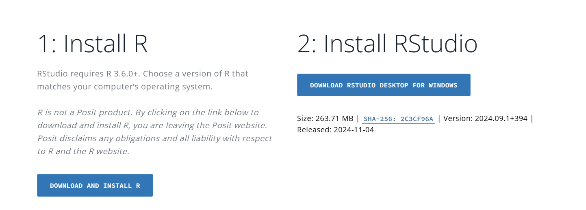
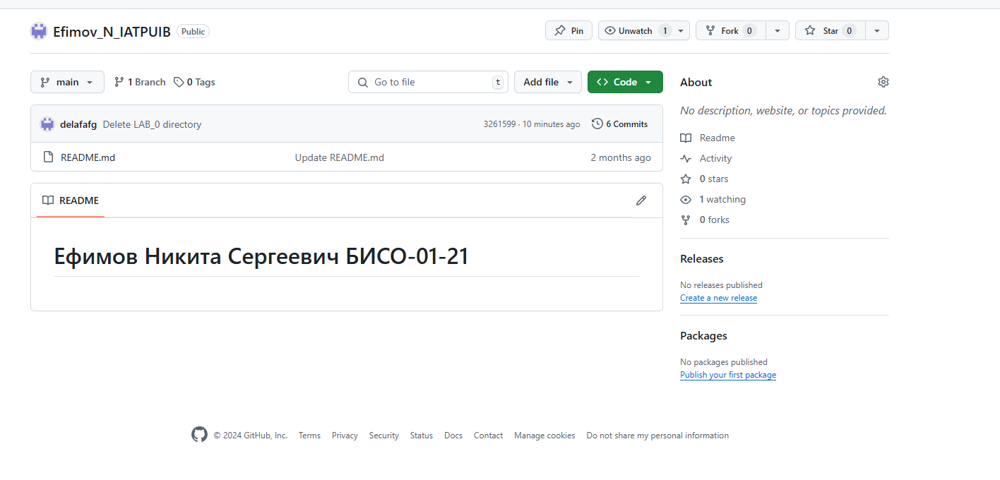
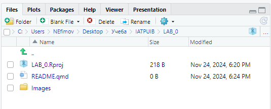

# LAB_0

2| Калинов Артем

Информационно-аналитические технологии поиска угроз инорфмационной
безопасности

# Подготовка воспроизводимых отчетов

## Цель работы

1.  Развить практические навыки использования языка программирования R

2.  Развить навыки работы с Rstudio

## Исходные данные

1.  Операционная система Windows 10
2.  Rstudio Desktop
3.  Интерпретатор языка R версии 4.4.2
4.  Github

## План выполнения работы

1.  Подготовить рабочее окружение для работы с RStudio
2.  Разработать отчет с использованием стека технологий Rmarkdown и
    Quarto
3.  Оформить отчет в соответствии с шаблоном

## Содержание Работы

### Шаг 1. Установка интерпретатора R

На данном шаге необходимо установить R и Rstudio, используя сайт
posit.co



### Шаг 2. Создание репозитория на GitHub

Создан репозиторий github mirea-practice



### Шаг 3. Создание проекта в RStudio и коммит изменений

Создан проект LAB_0



```r
print('hello, world!')
```

    [1] "hello, world!"

## Оценка результата

В результате работы было скачано ПО, был создан репозиторий, и отчет,
который был загружен в отдельную папку.

## Вывод

Были получены навыки создания отчетов в RStudio, а также получен опыт
выгрузки изменений на удаленный репозиторий GitHub.
