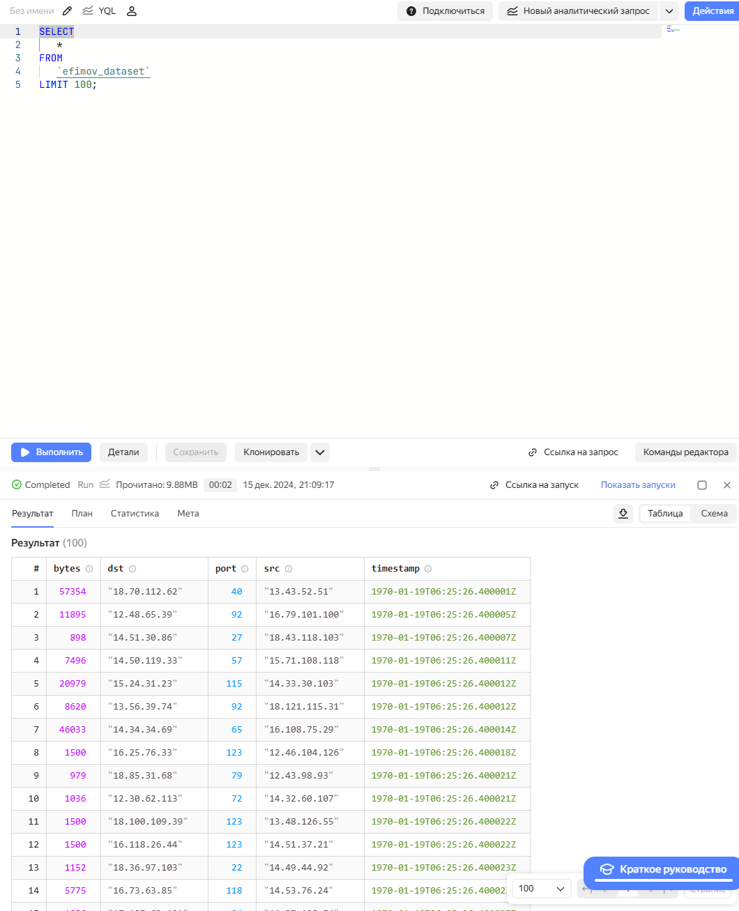

# LAB_4

Калинов Артем

Информационно-аналитические технологии поиска угроз инорфмационной
безопасности

# Использование технологии Yandex Query для анализа данных сетевой активности

## Цель работы

1.  Изучить возможности технологии Yandex Query для анализа
    структурированных наборов данных
2.  Получить навыки построения аналитического пайплайна для анализа
    данных с помощью сервисов Yandex Cloud
3.  Закрепить практические навыки использования SQL для анализа данных
    сетевой активности в сегментированной корпоративной сети

## Исходные данные

1.  Операционная система Windows 10
2.  Rstudio Desktop
3.  Интерпретатор языка R версии 4.4.2
4.  Github
5.  Yandex Cloud
6.  Yandex Query

## План выполнения работы

1.  Проверить доступность данных в Yandex Object Storage
2.  Подключить бакет как источник данных для Yandex Query
3.  Выполнить аналитические задания

## Содержание Работы

### Шаг 1. Проверить доступность данных в Yandex Object Storage

Данные доступны.


### Шаг 2. Подключить бакет как источник данных для Yandex Query

#### 1. Создать соединение для бакета в S3 хранилище


#### 2. Настройка привязки данных


#### 3. Проверка корректности данных с помошью запроса



```r
#SELECT * FROM 'efimov_dataset';
#LIMIT 100;
```

### Шаг 3. Выполнить аналитические задания

#### 1. Известно, что IP адреса внутренней сети начинаются с октетов, принадлежащих интервалу \[12-14\]. Определите количество хостов внутренней сети, представленных в датасете.


#### 2. Определите суммарный объем исходящего трафика


#### 3. Определите суммарный объем входящего трафика


## Оценка результата

В результате практической работы было созданое соединение для работы с
датасетом и выполнены аналитические задания

## Вывод

В результате выполнения практической работы были освоены инструменты
работы с Yandex Query
