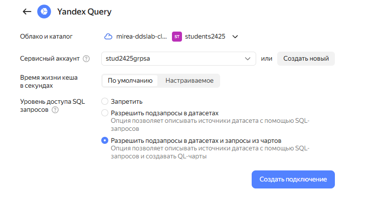
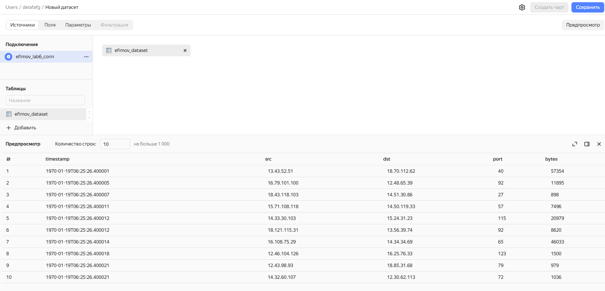
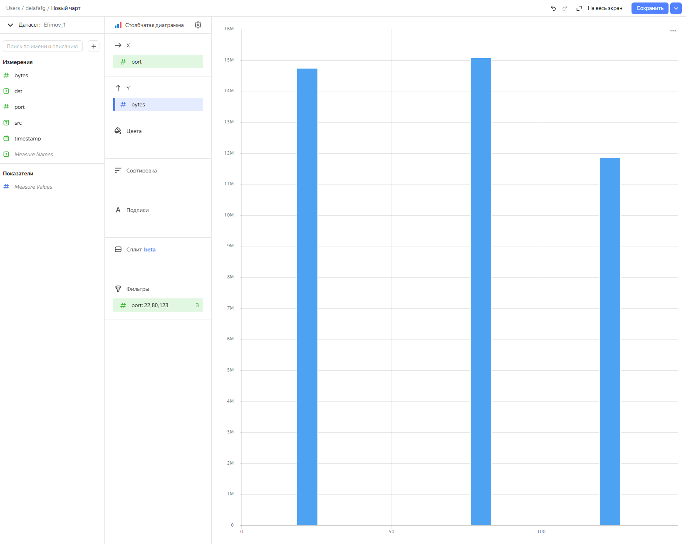
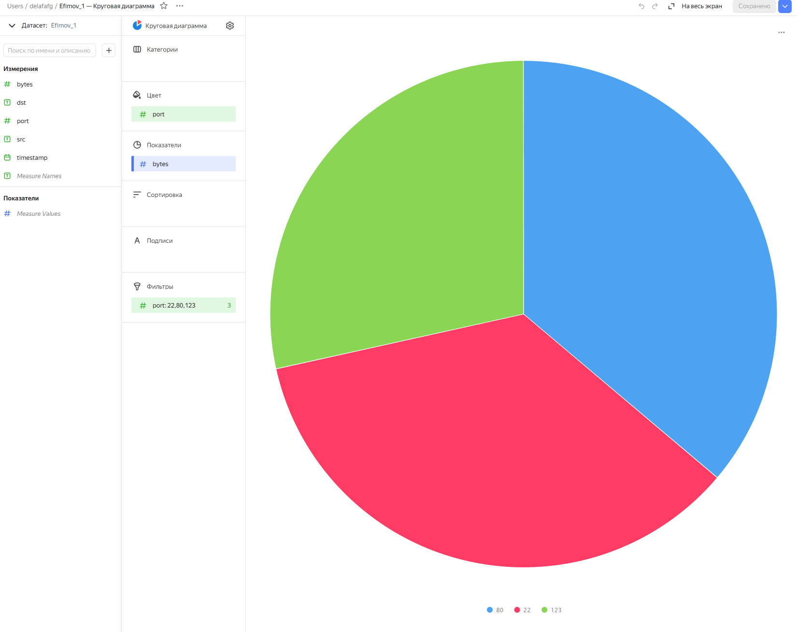
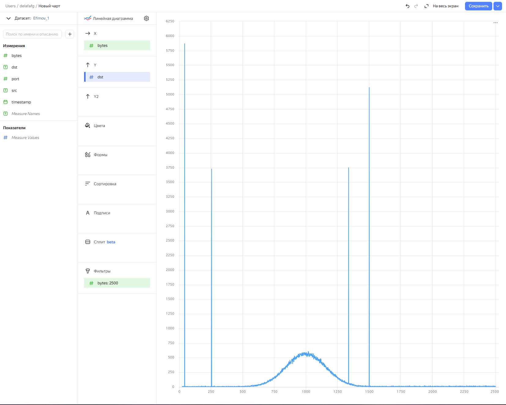
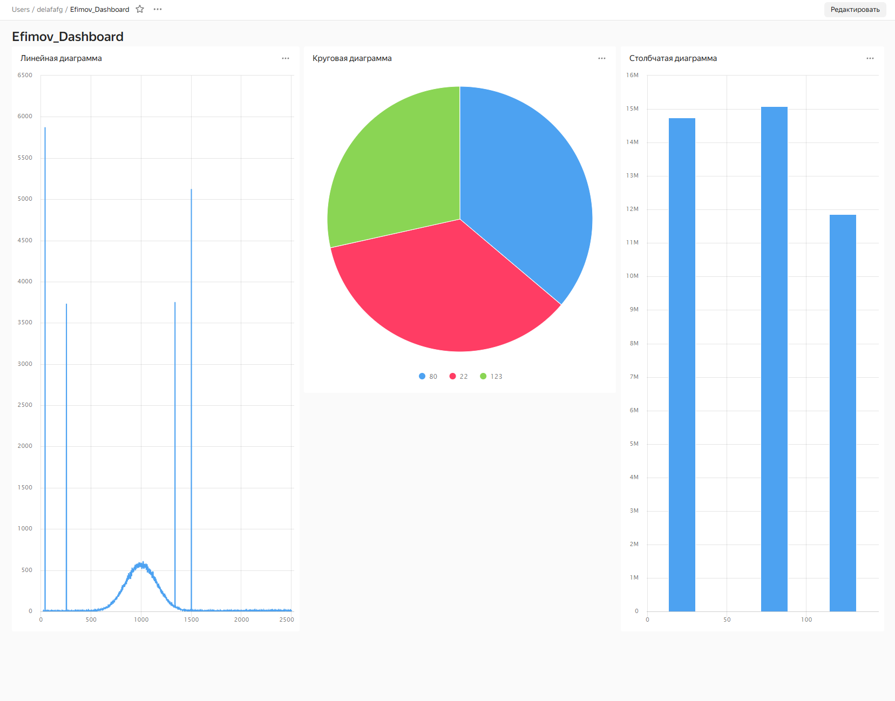

# LAB_6

Калинов Артем

Информационно-аналитические технологии поиска угроз инорфмационной
безопасности

# Использование технологии Yandex DataLens для анализа данных сетевой активности

## Цель работы

1.  Представить в виде круговой диаграммы соотношение внешнего и
    внутреннего сетевого трафика.
2.  Представить в виде столбчатой диаграммы соотношение входящего и
    исходящего трафика из внутреннего сетвого сегмента.
3.  Построить график активности (линейная диаграмма) объема трафика во
    времени.
4.  Все построенные графики вывести в виде единого дашборда в Yandex
    DataLens.

## Исходные данные

1.  Операционная система Windows 10
2.  Rstudio Desktop
3.  Интерпретатор языка R версии 4.4.2
4.  Github
5.  Yandex Cloud
6.  Yandex Query
7.  Yandex Lens

## План выполнения работы

1.  Настроить подключение к Yandex Query из DataLens
2.  Создать из запроса YandexQuery датасет DataLens
3.  Создать чарты
4.  Создать дашборд

## Содержание Работы

### Шаг 1. Настроить подключение к Yandex Query из DataLens

### Шаг 2. Создать из запроса YandexQuery датасет DataLens

### Шаг 3. Создать чарты

#### 1. Столбчатая диаграмма

#### 2. Круговая диаграмма

#### 3. Линейная диаграмма

### 4. Создать дашборд

Ссылка на дашборд: https://datalens.yandex.cloud/i4uie6lfceru5

## Оценка результата

В результате практической работы были созданы элементы визуализации -
чарты и дашборд

## Вывод

В результате выполнения практической работы были освоены инструменты
работы с Yandex Lens

\``wnl`
